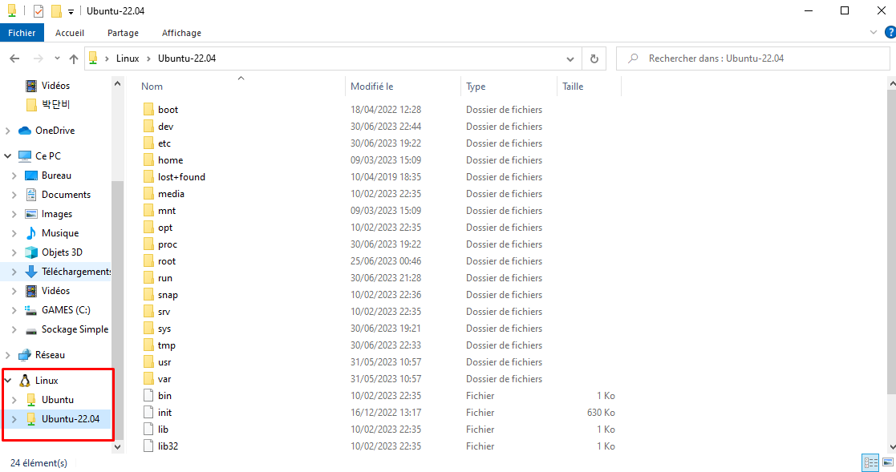
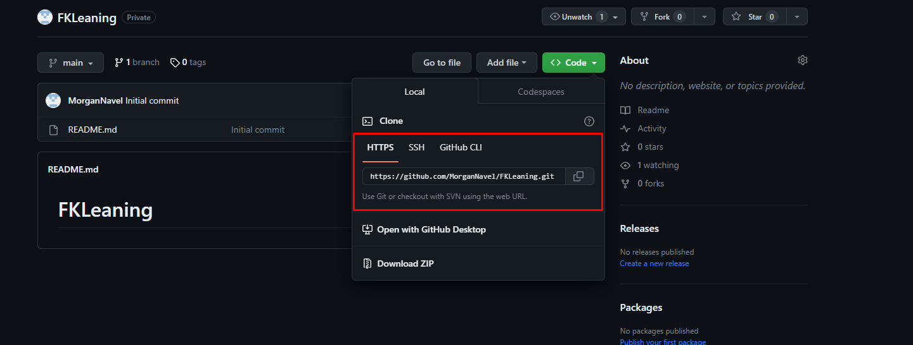

# FKLeaning
## Install WSL

To have a linux environment  within and a Windows Operating System. You don't have to do it but since I use that for my studies and that It's quite common to use in general, finding solution might be easier if you use also a Linux coding environment. You just have to follow the tutorial given by Microsoft, you'll see on your Windows Explorer that you'll have a file name Ubuntu if you took a Ubuntu distribution.

I recommend **Debian** or **Ubuntu** distribution, I use the Ubuntu version 22.04.

**Link for installing WSL**: https://learn.microsoft.com/en-us/windows/wsl/install

## Command for Linux

1. **sudo**

    This command will allow you to execute all your commands with the **ROOT** account. This the equivalent of the **ADMINISTRATOR** execution on Windows.
2. **sudo apt update**

    **Update** all the packages you have on your OS. **Packages** is the name used to talk about scripts, libraries ect ...
3. **sudo apt-get install [package name]**

    This will **download** and **install** a package given.
4. **sudo apt remove [package name]**

    It will **REMOVE** the package given in the command line. It will ask for confirmation. 
    
    **Note** : If removed by accident you can just re-install it with the command line above.

## Git Command lines
1. **git clone [URL]**

    **Clone the repository** from the URL given. You can clone with **2 URLs** are possible, one using **HTTPS** and one using **SSH**, both do the same.
    Using SSH will allow you to not register everytime you enter a command in the terminal. 

    

    If you want to use SSH you need to create private and public keys. You can follow tutorial below.
    
    **Install SSH**: https://docs.github.com/en/authentication/connecting-to-github-with-ssh/using-ssh-agent-forwarding
    

2. **git pull**

    **Pulling** take all the missing parts from your local repository. If there's conflict(s) either git will solve it by itself, or you might have to solve it by yourself by merging files between your local repository and the remote repository. 
    
    **Note** : Remote repository meaning the repository that you can see on GitHub.com and that you want to pull from.
3. **git add [FILENAME]**

    **Adding** will put all the files that has been modified, and will put it into the stage area (Area in between your local repository and the remote one), until you do a push to send it to the remote repository.
    
    **Note**: Instead of filename you can put "." that will means **ALL** within the **current directory**. You can also instead put **directories** that are in you're current directory it will add all the modified files/directory from the directory given in the command line.
4. **git status**

    Give you the **status** of your **working area and the staging area** e.g what you've committed but didn't pushed yet, and what you've add and didn't commit.
5. **git commit -m "[MESSAGE]"**

    Commit what you added with the command "git add [FILENAME]". The flag "-m" just means to add a message otherwhise you can't commit.

    **Note**: Each time you commit a commit ID is generated to identify the commit. You can also comeback to a old commit by using the "checkout" command and the ID of the commit.
6. **git push**

    Push all the commits from the stage to the remote repository.

    **Note**: If problems occures there might be conflict between files, eiter git solve it either you have to solve it by merging files together.
7. **git branch**

    Show all the branchs in the local repository. You might have some branch on the remote repository and not on the local, they exist you just don't see it, you just have to do a "git checkout [BRANCH NAME]".
    

8. **git branch [BRANCH NAME]**
    Create a branch on the local repository. To make it to the remote repository you need to add ,commit and push to this branch.
9. **git branch -d [BRANCH NAME]**

    The flag "-d" means delete, so it means delete the branch of name [branch name].

10. **git checkout [BRANCH NAME]**

    Allow you to go switch branchs.

11. **git merge [BRANCH NAME]**

    Merge the current branch with the branch given in the command line

    For example:
    I'm in the a branch called "main" (origin) and we developped a feature on another branch that I called "feat1", to merge main and feat1, I have to do "git checkout main" and then do a "git merge feat1".

    **Note**: If during the merge there's a conflict It has to solve by choosing what to take/delete/modify

